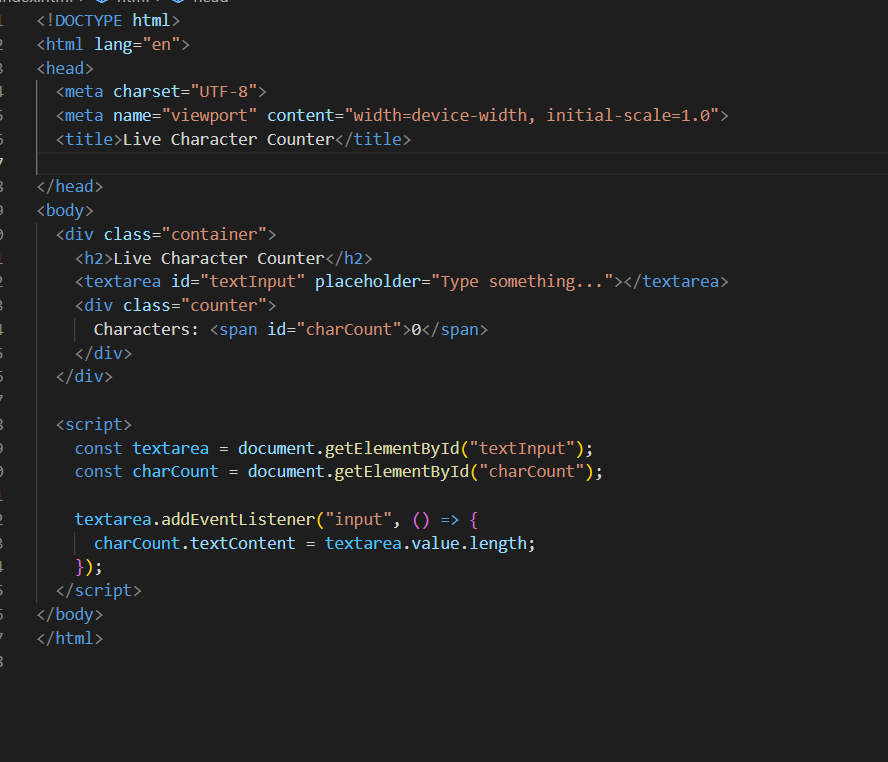
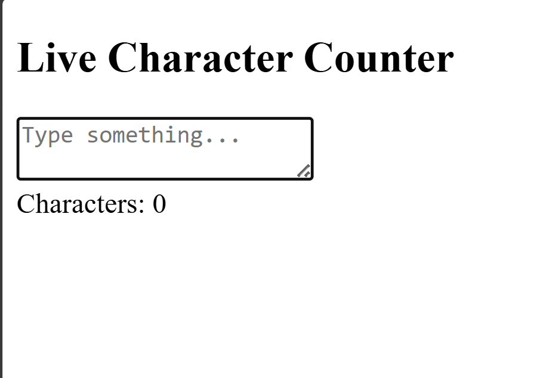
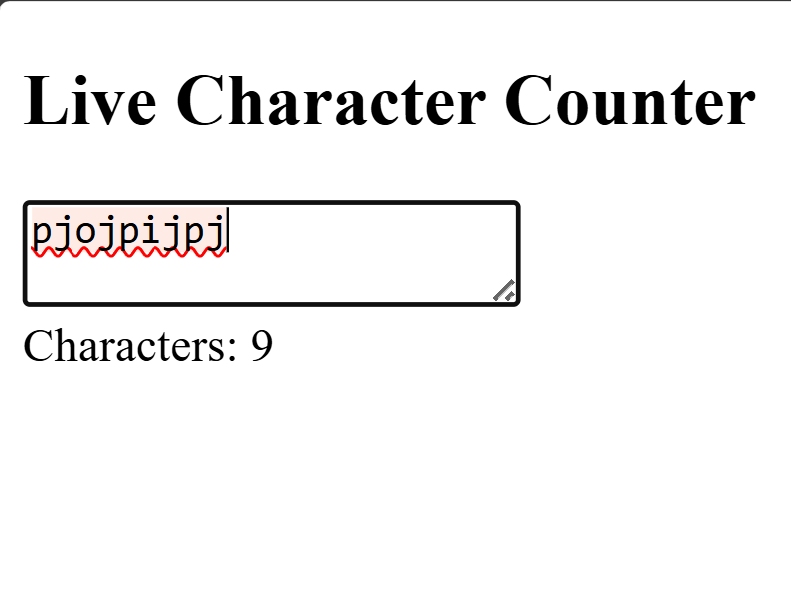

# Live Character Counter for Textarea

## 🎯 Aim
To build a simple web page feature that displays a live character count as the user types in a textarea, enhancing real-time user interaction and feedback.

---

## 📌 Objective
Create a textarea where users can type text and display a live character counter below it. The counter should update immediately whenever the user types or deletes content, showing the exact number of characters entered.

---

## 📝 Task Description
- Create a textarea element for user input.  
- Add a character counter section below or beside the textarea.  
- Use **JavaScript event handling** (`input` event) to dynamically update the counter.  
- Style the page using basic **CSS** to make it user-friendly.  

---

## 💻 Code Implementation

Output Screenshot:

🎓 Learning Outcomes

By completing this project, you will:

Understand real-time event handling in JavaScript using the input event.

Learn how to manipulate the DOM dynamically to update UI elements instantly.

Practice basic CSS styling to create a clean and user-friendly interface.

Enhance problem-solving skills by implementing a simple yet practical feature used in real applications (e.g., Twitter, text editors).

